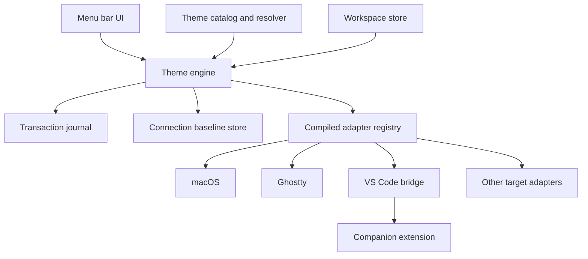

# MVP product and architecture plan

## Product contract

Oh My Theme is a macOS menu-bar utility that applies one theme assignment to a connected developer workspace.

> **One theme for your entire Mac.**
> Switch macOS and your connected developer apps together.

"Connected" is deliberate. Oh My Theme only claims control of target instances that completed one-time setup and expose a supported activation path. Installing a theme asset without being able to activate it on later switches does not count as support.

The first release should prove this outcome:

> After one-time setup, one choice changes my connected workspace and tells me exactly what changed, what needs a reload, and what could not change.

## Settled product boundaries

### Included in the beta

- One local Workspace presented as "My Mac."
- Target Instances in the internal model, with application-level UI unless several instances need attention.
- Fixed theme assignments in the initial UI.
- A stored Light/Dark pair assignment for later UI work.
- Hybrid theme sourcing. Prefer pinned upstream ports and use generated themes where allowed.
- Catppuccin Mocha plus one clearly labeled generated theme for the vertical demo.
- Optional static, pack-provided wallpaper per Theme Variant.
- Per-target setup, apply, activation reach, conflict, and recovery reporting.
- Connection Baseline and Undo Last Theme Change.
- Opt-in Launch at Login.
- A Target Catalog with an external GitHub Discussion request path.
- Experimental adapters that use documented mechanisms only.

### Excluded from the beta

- Theme editing and arbitrary theme-pack import.
- Wallpaper-to-palette generation.
- Dynamic wallpapers and every-Space guarantees.
- System accent-color mutation.
- Repeated manual theme selection presented as support.
- Private preference writes, app-database edits, process killing as an undocumented reload, and GUI input simulation.
- Runtime adapter plugins or remote executable adapter updates.
- Cloud sync and multiple-machine state.
- Multiple user-visible Workspaces.
- Background telemetry.
- Nix as the apply engine.
- Mac App Store distribution.
- Pricing, payment, and Free or Pro feature tiers.

## Support model

### Supported outcomes

| Outcome | Meaning |
| --- | --- |
| Applied | The requested theme is active in the intended running instances. |
| Applied after setup | A one-time extension, include, profile, permission, or script setup was required. Later switches are automatic. |
| Reload required | Oh My Theme changed the active setting, but the target needs a documented reload or reopen. |
| Next launch | Persisted configuration is correct for future processes, but current processes cannot update. |
| Unavailable | Oh My Theme cannot activate the theme through a supported mechanism. Asset installation alone remains unavailable. |

Every capability reports configuration state and running-instance reach separately:

```text
Configuration: Updated | Unchanged | Conflicted | Failed
Running instances: Updated | New processes only | Reload required | Unknown
```

A missing app, denied optional permission, or unavailable target does not cancel unrelated targets.

### User-facing catalog states

Keep the main interface simple:

- Ready
- Setup needed
- Unavailable

The target detail view may explain whether an adapter is Experimental, Planned, In research, or blocked by the target application. Only work accepted into a release milestone may use "Coming soon."

"Request this app" opens a prefilled GitHub Discussion. The app does not send request telemetry in the background.

## Theme model

### Theme packs and variants

```text
ThemePack
  schemaVersion
  id
  displayName
  author
  sourceURL
  sourceRevision
  license
  variants[]

ThemeVariant
  id
  qualifiedID: <pack-id>/<variant-id>
  contentDigest
  appearance: light | dark
  ui roles
  terminal roles and ANSI colors
  syntax roles
  wallpaper?
```

Stored colors use normalized, device-independent sRGB values. Alpha is permitted only for roles whose target compilers support it. Generated artifacts and receipts record theme schema, source revision, content digest, and compiler version.

The semantic model contains target-independent meanings. It must not contain AppKit color objects, application setting keys, TextMate scopes, or target config paths.

### Hybrid theme resolution

Each target-theme combination resolves according to the Workspace policy:

1. Prefer upstream: choose a pinned Upstream Port when compatible, otherwise use a validated Generated Theme.
2. Require upstream: choose a compatible pinned Upstream Port or report unavailable.
3. Use generated: choose a validated Generated Theme even when an upstream port exists.
4. Report unavailable when the selected policy cannot produce a validated result.

Do not merge upstream ports with generated overrides. Preview and apply reports identify the selected source and revision.

The stored model supports three Theme Source Policies:

- Prefer upstream ports, then use generated themes.
- Require upstream ports.
- Use generated themes.

The beta defaults to the first policy and may keep the selector out of the main interface.

### Wallpaper

A Theme Variant may contain one licensed static wallpaper asset and placement metadata. Light and Dark variants may differ.

Wallpaper is an independently enabled macOS capability. Users can choose "Keep my current wallpaper" without disabling the rest of the macOS adapter. Apply only to selected connected displays and capture the prior image and placement per display.

The beta does not download wallpaper URLs during apply, generate palettes from images, or promise dynamic wallpaper and every-Space behavior.

## Workspace and target instances

The beta exposes one Workspace named "My Mac." It has a stable identifier and contains selected Target Instances.

A Target is an application or macOS capability. A Target Instance is a concrete settings context, such as:

- VS Code Stable, Default Profile
- iTerm2, Shared Profile
- iTerm2, current session
- Neovim, default configuration
- tmux, one server
- macOS Appearance, one machine-wide instance
- macOS Wallpaper, one instance per connected display

The MVP automatically chooses the default instance when unambiguous. Advanced instance selection stays hidden until discovery finds ambiguity or the adapter requires a choice.

A Theme Assignment is either:

```text
fixed(ThemeVariantID)

or

appearancePair(
  light: ThemeVariantID,
  dark: ThemeVariantID
)
```

The first UI exposes fixed assignment. The model keeps paired assignment so later system-following support does not require a migration.

## Runtime architecture



### Theme engine

The UI talks to one deep module:

```text
prepare(themeVariant, workspace) -> ApplyPreview
apply(previewID) -> ApplyReport
undoLast(workspace) -> ApplyReport
restoreAndDisconnect(targetInstances) -> ApplyReport
```

The engine owns orchestration, serialization, immutable previews, durable journal transitions, recovery on launch, and report aggregation. The UI does not discover apps, edit files, send Apple Events, launch target commands, or coordinate rollback.

### Adapter seam

Adapters are compiled, reviewed implementations. Theme packs remain data-only.

Conceptually, each adapter must support:

```text
discover() -> TargetInstances
prepareConnection(instance) -> ConnectionPlan
connect(plan) -> ConnectionReceipt
prepareApply(instance, resolvedTheme) -> AdapterPlan
apply(plan) -> AdapterReceipt
recover(pendingRecord) -> RecoveryResult
rollback(receipt) -> RollbackResult
disconnect(instance, baseline, mode) -> DisconnectResult
```

Connection Plans and Adapter Plans are immutable and serializable. Each includes intended-change digests, captured pre-change values, stale-state tokens, expected side effects, required permissions, and a versioned opaque payload owned by the adapter.

`connect` and `apply` consume their prepared plans. They must not regenerate output after user review. Immediately before each write or external mutation, the adapter revalidates file identity, hashes, target version, and relevant setting values against the plan. A stale plan stops as a conflict.

Every side effect must either be idempotent or expose enough inspection state for recovery to classify the current target as before-change, intended-after-change, or conflicting. Recovery may reconstruct a receipt when intended state is already present, retry an idempotent operation from before-state, or stop on any third state. It must never blindly repeat an ambiguous effect.

Do not create a generic adapter-manifest language for the MVP. Share deep internal modules for config discovery, structured edits, command execution, Apple Events, managed files, journaling, and companion messaging. Extract declarative adapter definitions only after several adapters prove the same narrow shape.

### Apply transaction

There is no atomic operation shared by macOS and third-party applications. The engine uses a durable recoverable sequence:

1. Resolve the Theme Variant for every selected Target Instance.
2. Prepare all adapters without writing.
3. Present exact setup needs, source choices, conflicts, and expected activation reach.
4. Persist the transaction and all Adapter Plans as `prepared` before the first target changes.
5. Mark one adapter `applying` before invoking it.
6. Revalidate that plan at its write boundary.
7. Persist its receipt and advance through `applied`, `verified`, or `rollback-required`.
8. Continue independent targets after target-specific failures.
9. Reconcile any record left in `applying` on the next launch before accepting another transaction.
10. Return one Apply Report grouped by Target Instance and capability.

Global theme-schema failure stops before writing. A target-specific failure does not automatically roll back unrelated targets because partial application is an accepted product outcome. The failing adapter attempts local rollback when activation fails after mutation and it can prove rollback is safe. Otherwise it retains a recovery-required receipt. The user may undo the complete last Apply Transaction afterward.

## Configuration ownership and recovery

### Single-writer rule

A Managed Artifact has one Configuration Owner at a time. Oh My Theme must not compete with Nix, another declarative manager, the target app, or the user for the same value.

Prefer this ownership shape:

1. Add one reviewed include, import, or source line to user configuration.
2. Own a separate generated artifact.
3. Update only the owned artifact on later switches.
4. Activate through a target-documented command or interface.

For formats without an include seam, mutate only registered keys through a syntax-aware editor. Preserve comments, line endings, mode, ownership, ACLs, flags, and relevant extended attributes.

Never use `sudo`.

### Dotfiles and Nix

When a config file is an ordinary symbolic link, resolve and show the source path during connection. Require explicit approval before changing the linked source. Explain that the edit may appear in the user's dotfiles repository.

When a path points into `/nix/store` or a Home Manager generation, stop and report "Managed by Nix." This minimal ownership check belongs in the MVP because direct writes could corrupt or fight declarative state.

The MVP does not install Nix, invoke Home Manager, modify flakes, update lock files, or activate nix-darwin.

Later options:

1. Export a new data-only Home Manager module to a user-selected directory.
2. Let the user review, import, and activate it through their existing configuration.
3. Consider a Nix-owned Experimental mode only when one exact user-owned flake output and activation command are registered.
4. Disable native writes for every Target Instance owned by Nix.

### External changes

If a connected target changes outside Oh My Theme, mark it "Changed Outside Oh My Theme." Offer:

- Review changes
- Reapply selected theme
- Restore and disconnect
- Stop managing and keep files unchanged

The last option relinquishes ownership and removes the target from the Workspace without editing uncertain state. It may leave managed artifacts or includes in place, so the result must list residual paths for manual cleanup.

Do not silently reapply at login or app launch. The original Connection Baseline remains unchanged.

### Two recovery references

Keep two distinct recovery references:

- Connection Baseline: state captured immediately before the first connection change.
- Last Apply Transaction: the most recent completed transaction that changed at least one Target Instance, containing one receipt per changed instance.

The UI exposes:

- Undo Last Theme Change
- Restore and Disconnect

Undo applies only to the Last Apply Transaction. A skipped, no-change, or fully failed attempt does not replace it. A partial transaction becomes the last transaction when at least one target changed. The previous undo reference remains durable until the new transaction reaches terminal states. Successful rollback marks each receipt undone; unresolved receipts remain visible and cannot be silently reused by a later Undo.

Automatic restore and rollback change only state Oh My Theme can prove it owns. If current state differs from the expected managed state, stop and show a diff. The beta has no force-overwrite action.

Store complete bytes only when exact restoration requires them. Prefer prior values, inserted-line identity, hashes, and metadata. Protect baseline files with user-only permissions. Never put baseline contents in logs or diagnostic exports.

"Reset Oh My Theme" reviews all connected targets, restores what remains safe, removes Managed Artifacts, releases retained permissions, disables Launch at Login, and quits. Dragging the app to the Trash cannot run cleanup, so uninstall guidance must direct users to Reset first.

## Adapter scope

### Vertical demo

1. macOS
2. Ghostty
3. VS Code
4. Starship

This covers system visuals, managed config, Apple Events, a companion extension, structured settings, and next-prompt activation.

### First free beta

Add:

5. kitty
6. iTerm2
7. Neovim
8. tmux

This is enough breadth to test command adapters, per-session Target Instances, reload-required outcomes, and sourced configuration without building the whole Target Catalog.

### Target-specific expectations

| Target | Beta route | Expected reach |
| --- | --- | --- |
| macOS Appearance | Optional permissioned Dark Mode automation | One machine-wide appearance instance |
| macOS Wallpaper | Public wallpaper interface | One instance per selected connected display |
| Ghostty | Managed config fragment, documented reload, optional AppleScript automation | Current windows when supported, otherwise reload required |
| VS Code | Companion extension and supported settings interface | Active supported profile and window, with override reporting |
| Starship | Registered TOML keys and palette tables | Next prompt |
| kitty | Supported themes kitten with reload | Running kitty windows supported by the command |
| iTerm2 | Installed preset plus official Python interface | Selected shared profiles or live sessions |
| Neovim | Managed Lua fragment and documented source or restart | Reload required unless a configured supported server exists |
| tmux | Managed sourced fragment and `source-file` | Selected running tmux server |

macOS accent-color mutation remains unavailable because no public setter is documented.

### Later researched targets

The research found viable paths worth reassessing after beta evidence:

- bat
- Fish
- btop
- git-delta
- Terminal.app
- Sublime Text
- Alacritty
- WezTerm
- Helix
- lazygit

Arbitrary Zed activation, JetBrains, Obsidian, Warp, and Xcode remain research or blocked items until a supported every-switch route exists. Asset installation by itself does not promote them to supported.

## Experimental policy

Experimental adapters may use documented configuration formats, commands, extension interfaces, scripting dictionaries, and public operating-system interfaces. They may support narrower versions or have less compatibility evidence.

Experimental status never weakens the safety floor. Connection Baseline capture, durable pre-write plans, write-boundary revalidation, single-owner checks, guarded rollback, crash reconciliation, and conflict-safe disconnect are mandatory before an Experimental adapter may write.

Experimental does not permit:

- Undocumented `defaults write` keys
- Private app preferences or databases
- Accessibility-driven clicks or keystrokes
- Process termination presented as a reload interface
- Silent replacement of complete user configurations
- Unauthenticated companion listeners

Unknown target versions start with read-only assessment. A new patch inside a validated compatibility range may continue. An unknown minor or major version pauses writes unless format and activation validation support an explicit Experimental opt-in.

## Beta experience

### First run

1. Discover candidate Target Instances.
2. Present one Workspace named "My Mac."
3. Let the user choose targets and wallpaper behavior.
4. Prepare a read-only Connection Plan and theme preview.
5. Show exact one-time ownership changes and explain each permission.
6. Immediately before connection, revalidate the source state.
7. Durably persist the Connection Baseline and pending Connection Plan.
8. Run `connect` and persist its receipt before marking the Target Instance connected.
9. Reconcile an interrupted connection on the next launch before another connection or apply.

### Normal use

1. Select a Theme Variant from the menu-bar panel.
2. Review blockers only when something changed since the last safe plan.
3. Apply ready targets.
4. Show concise Target Instance outcomes and remaining User Actions.
5. Keep Undo Last Theme Change available.

Launch at Login is opt-in and disabled by default. Launching the app does not automatically overwrite drifted configuration.

### Beta rollout

The beta is free. Pricing, payment, trials, and feature tiers are deferred.

Start with the developer's own testing. Plan private and public beta rollout only after the vertical demo is safe enough to distribute. There is no background telemetry. Validation uses interviews, explicit diagnostic export, local Apply Reports, and GitHub Discussion requests.

Developer ID signing, notarization, updater choice, and external distribution are release gates to revisit before other users receive builds. They are not prerequisites for local development.

## Delivery plan

### Stage 0: focused proofs

- Menu-bar lifecycle, removal recovery, and explicit Quit behavior.
- Static wallpaper behavior across current displays and Spaces.
- Permission grant and denial for system Dark Mode automation.
- Ghostty config precedence, staged validation, and reload behavior.
- VS Code companion request authentication, acknowledgement, profiles, overrides, and local extension-host behavior.
- Starship format-preserving mutation and next-prompt behavior.
- Ordinary symlink and Nix-managed path detection.
- Catppuccin and wallpaper source, license, attribution, and pinned revision.

A failed proof narrows or removes the promise. It does not trigger a private workaround.

### Stage 1: vertical demo

- One Workspace and fixed Theme Assignment.
- Catppuccin Mocha and one generated variant.
- macOS, Ghostty, VS Code, and Starship.
- Optional static wallpaper.
- Read-only preview and one-time connection review.
- Durable apply journal and launch recovery.
- Apply Report with configuration and running-instance reach.
- Connection Baseline, Undo Last Theme Change, and Restore and Disconnect.

Exit when repeated switches and interrupted applies on the developer machine do not lose user-owned configuration.

### Stage 2: free beta breadth

- Add kitty, iTerm2, Neovim, and tmux.
- Add application and Target Instance discovery.
- Add version ranges and Experimental opt-in.
- Add Changed Outside Oh My Theme handling.
- Add reset and disconnect flows.
- Add the simple Target Catalog and GitHub Discussion request link.
- Complete schema validation, source attribution, and generated-output golden tests.

Exit when the selected eight targets meet their stated activation reach and all destructive paths have guarded recovery.

### Stage 3: distribution decision

After local testing, decide:

- Private beta timing and audience
- Developer ID enrollment
- Notarization
- Signed update delivery
- Crash and diagnostic collection policy
- Public beta readiness

Do not start broad adapter expansion until initial users confirm that synchronized switching is useful and trustworthy.

## Testing requirements

### Theme resolution and compilation

- Schema and identity validation
- Upstream pin and license metadata
- Source-policy resolution
- Semantic-role completeness
- Deterministic generated artifacts
- Golden output for every beta target-theme combination
- Wallpaper asset and attribution checks

### Adapter contract

Every adapter needs tests for:

- Missing, ambiguous, and multiple Target Instances
- Supported and unsupported versions
- Permission grant, denial, and revocation
- Ordinary symlinks and Nix-managed links
- External change between prepare and apply
- Process termination at every journal transition
- Successful apply with verification
- Persisted configuration with incomplete runtime reach
- Activation failure after a successful write
- Undo before and after an external change
- Restore and disconnect with and without conflict
- Ownership, mode, ACL, flag, and extended-attribute preservation where files are replaced

### Manual release checks

Automated tests cannot prove privacy prompts, App Review behavior, every macOS Space, or third-party UI refresh. Maintain a release checklist for supported macOS and target versions, clean privacy permissions, multiple windows or sessions, and multiple displays where available.

## Technical stack

The implementation stack is settled in [`technical-stack.md`](./technical-stack.md). It satisfies the interfaces and invariants in this plan rather than redefining them.

## Research

- [`mvp-platform-feasibility.md`](../research/mvp-platform-feasibility.md)
- [`themeable-app-ecosystem.md`](../research/themeable-app-ecosystem.md)
- [`themeable-app-ecosystem-addendum.md`](../research/themeable-app-ecosystem-addendum.md)
- [`theme-activation-escalation.md`](../research/theme-activation-escalation.md)
- [`nix-theme-management.md`](../research/nix-theme-management.md)
